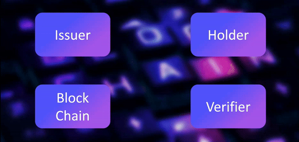

# Block VerifyX
## Document Verification using Tezos Blockchain

<!-- # Project is hosted at [https://buffer.cxponxtu.live](https://buffer.cxponxtu.live) -->
## Project Overview

This project leverages the Tezos blockchain to securely verify documents issued by institutions, enabling employees and employers to authenticate certificates without compromising data privacy or integrity. By utilizing blockchain technology, a document's hash is added to the chain while the actual document remains local, ensuring a decentralized yet reliable method of verification.

## Approach

The project involves three key entities:

1. Issuer: Adds the hash of a verified document to the blockchain.
2. Holder: Sends the certificate and related documents through a website.
3. Verifier: Verifies the authenticity of the employee's certificate by comparing the hash on the blockchain with the local document hash and the address of both the Holder and Issuer.

## Flowchart



## Demo

https://github.com/user-attachments/assets/a9deeed5-c6b4-499a-bc82-4746346c8213

## Hackathon Details
| Hackathon      | Website                        | Smart Contract Address                       | Team Name        |
|----------------|--------------------------------|---------------------------------------------|------------------|
| Transfinitte 24 | [https://transfinitte.com/](https://transfinitte.com/) | KT1TqwLzY5uxiFAUbxxj4QQ9i56LJttp8M89 | 8uffer_0verf1ow  |

>__E-Mail__ : cxponxtu@gmail.com

## Getting Started

- To deploy smart contract on Tezos BlockChain, use `contract.py` in SmartPy IDE to deploy it on Tezos Ghostnet.
- Then copy the contract address and paste it in `.env` file of both backend server and client server.
- To deploy the services, we are using docker. Services can be started by
```sh
    docker compose up
```

> __Note__ : `compose.yml` is written for `docker compose`(v2) not for `docker-compose`(v1)


## Use Cases

1. *Educational Certificate Verification*: Verifying university diplomas or academic records.
2. *Legal Documents and Contracts*: Secure validation of legal contracts.
3. *Healthcare Records Authentication*: Verification of healthcare records using blockchain.
4. *Patent or Intellectual Property Verification*: Verifying ownership or intellectual property rights.
5. *Government Certifications*: Ensuring authenticity of official government documents.

## Tech Stack

The project is built using the following technologies:

- *Tezos Blockchain Temple Wallet (Ghostnet)*: For securely storing document hashes and testing the application.
- *SmartPy*: A Python library to create smart contracts. It converts Python code to Michelson (a low-level language used for developing smart contracts on the Tezos blockchain).
- *Temple Wallet*: For blockchain transactions.
- *Beacon SDK*: To interact with the Tezos blockchain from the web.
- *MongoDB*: To store users' local document data securely.
- *Taquito*: A JavaScript library to interact with the Tezos blockchain.
- *React*: For building the user interface of the application.
- *Express.js*: For backend development.


