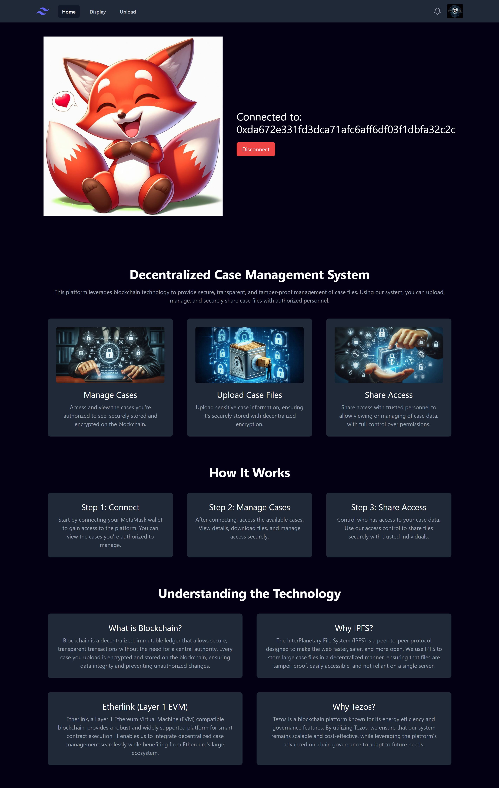
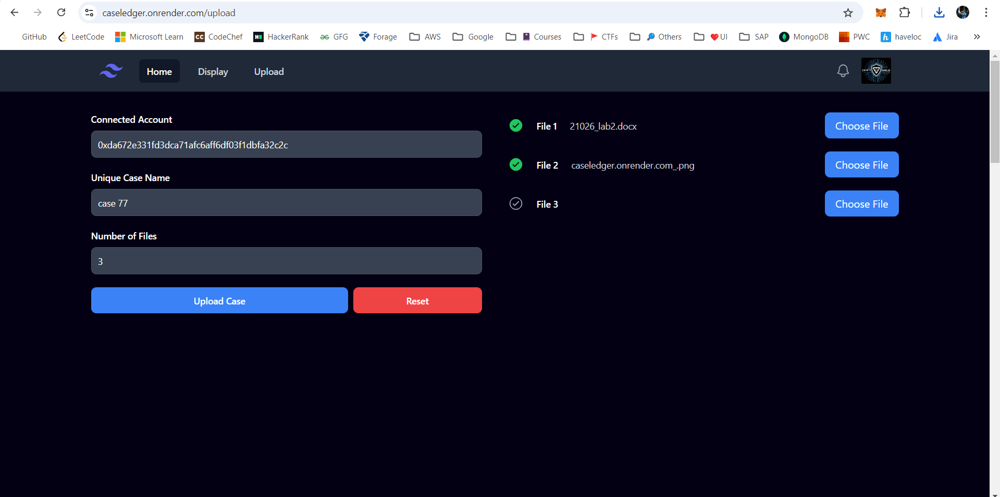

# CaseLedger - https://caseledger.onrender.com/

## Overview

**CaseLedger** is a decentralized case management system leveraging blockchain technology to enhance the transparency, security, and immutability of legal case records. Designed to streamline case management processes, CaseLedger ensures that all case-related data is securely recorded and easily accessible while maintaining integrity and transparency.

> Access the deployed page on : https://caseledger.onrender.com/

> Etherlink Contract Address: 0x04C340f664F9B3755B5916e4e72A63cF0475b857

> Contract deployed on: https://testnet.explorer.etherlink.com/address/0x04C340f664F9B3755B5916e4e72A63cF0475b857

> Demo Video: 
> 1) https://drive.google.com/file/d/1vgtxhFjENC_KIwNoChVTuT0Qh8Qw3aUI/view?usp=sharing
> 2) https://app.weet.co/play/62362966/create-video-tutorials-with-weet

## Features

- **Decentralized Storage**: Securely store and manage case data on the blockchain.
- **Immutability**: Guarantee that case records are tamper-proof and can be audited.
- **Transparency**: Provide a clear, transparent record of all case updates and changes.
- **Access Control**: Manage and enforce permissions and access rights for users and stakeholders.

## Hackathon details:
> Name: *CryptoShield Hackathon (Amrita CyberNation 2024)*
>
> Team Name: BlueSharks
> 
> Team Members:
> 1) Jayaraj Viswanathan
> 2) Dinesh kumar
> 3) Parasaran Narayanan






## Installation

To set up **CaseLedger** on your local machine, follow these steps:

1. **Clone the Repository**:
    ```bash
    git clone https://github.com/your-username/caseledger.git
    ```

2. **Navigate to the Project Directory**:
    ```bash
    cd caseledger
    ```

3. **Install Dependencies**:
    - For the frontend:
      ```bash
      cd ../frontend
      npm install
      ```

4. **Start the Application**:  ```
    - For the frontend:
      ```bash
      cd ../frontend
      npm start
      ```

## Usage

1. **Capture Case Data**:
   Utilize the web interface to input and capture case information. The data will be securely recorded on the blockchain.

2. **Manage Cases**:
   Access and manage case records through the user interface.

3. **Verify Records**:
   Ensure the integrity of case records with blockchain verification.

## Contributing

We welcome contributions to **CaseLedger**! To contribute:

1. Fork the repository.
2. Create a new branch (`git checkout -b feature-branch`).
3. Commit your changes (`git commit -am 'Add new feature'`).
4. Push to the branch (`git push origin feature-branch`).
5. Create a new Pull Request.
