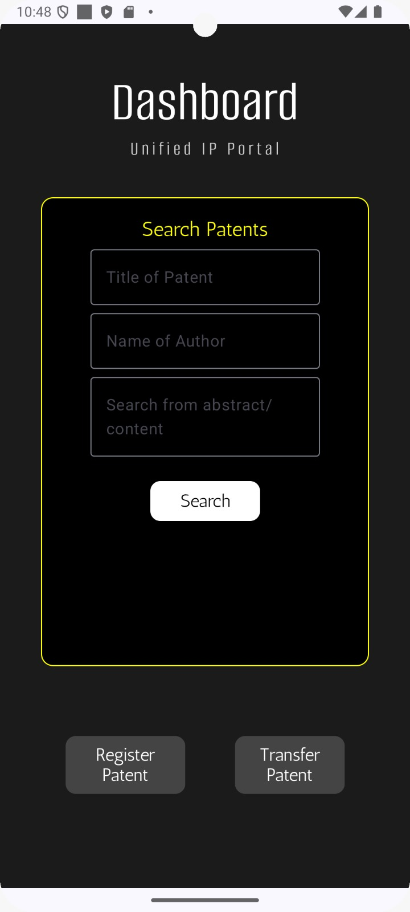
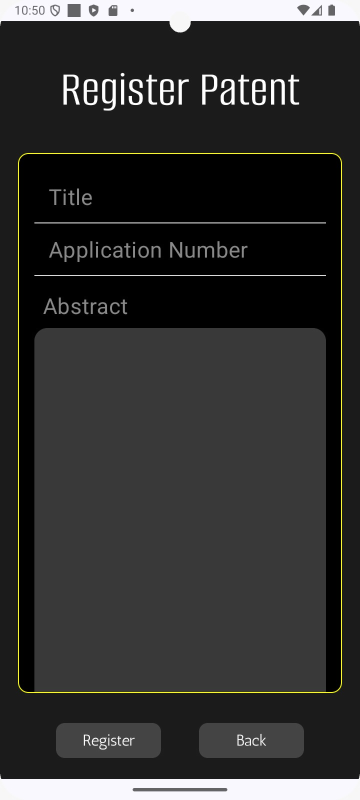
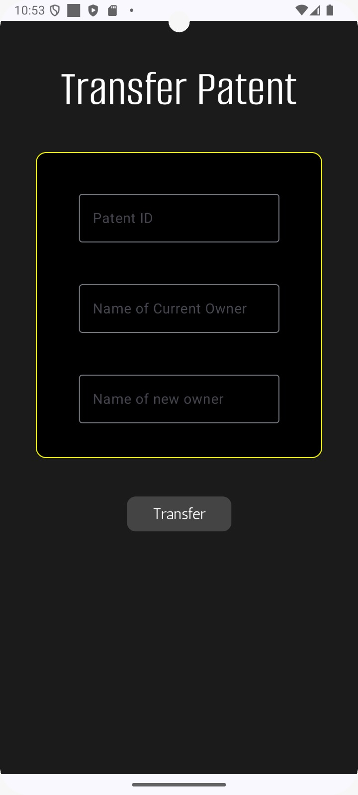
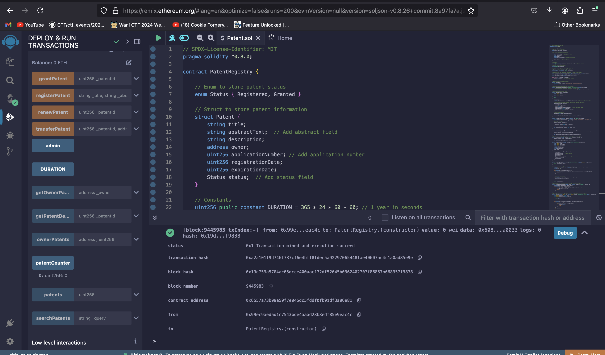
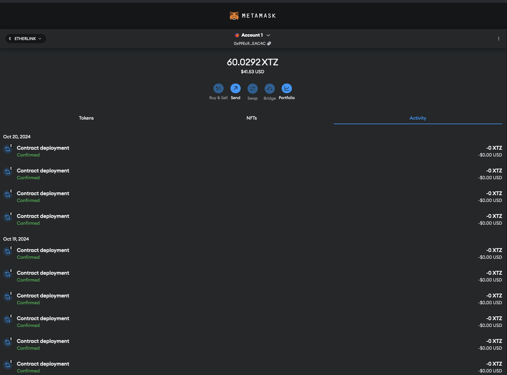

# **Decentralized Patent Registry DApp**

## **Table of Contents**
- [Project Overview](#project-overview)
- [Features](#features)
- [Tech Stack](#tech-stack)
- [Android App](#android-app)
  - [Home Screen](#home-screen)
  - [Patent Registration](#patent-registration)
  - [Patent Transfer](#patent-transfer)
  - [Etherlink Deployment](#etherlink-deployment)
  - [Transaction Details](#transaction-details)
- [Smart Contract Details](#smart-contract-details)
  - [Smart Contract Code](#smart-contract-code)
- [How to Run the Project](#how-to-run-the-project)
  - [Prerequisites](#prerequisites)
  - [Smart Contract Deployment](#smart-contract-deployment)
  - [Backend Setup](#backend-setup)
  - [API Endpoints](#api-endpoints)
- [Testing the Smart Contract](#testing-the-smart-contract)
- [Future Improvements](#future-improvements)
- [Contributing](#contributing)
- [License](#license)

---
# **Decentralized Patent Registry DApp**

## **Project Overview**
The Decentralized Patent Registry DApp is a blockchain-based platform for registering, managing, and transferring ownership of patents. This decentralized solution ensures transparency, immutability, and verifiable ownership, offering a secure way to protect intellectual property on a public blockchain. 

The project leverages Etherium (or compatible EVM networks) for smart contracts and enables patent owners to register their inventions, transfer ownership, and verify patent details without relying on centralized authorities.We use **Etherlink** to deploy it on the EVM network.

Every author will be identified uniquely by their wallet id which alligns with the idea of decentralisation.

## **Features**
**These features are available on our dapp**
- **Patent Registration**: Users can register a patent by providing its title, description, and associating it with their blockchain wallet address.
- **Ownership Transfer**: The DApp allows patent owners to transfer ownership of patents to another address securely.
- **Patent Lookup(WIP)**: Anyone can query patent details like title, description, and current owner.
- **Decentralization**: Powered by Ethereum (or any EVM-compatible blockchain), this DApp eliminates the need for intermediaries or centralized control.


## **Tech Stack**
- **Kotlin**: Used for implementing the frontend of the dapp as a native Android app.
- **Solidity**: Smart contracts written in Solidity to handle patent registration, transfers, and lookups.
- **Ethereum (or Sepolia Testnet)**: Deployed on an EVM-compatible network.
- **Web3.js**: Interact with the smart contract through a Node.js backend.
- **Node.js/Express**: Backend API for handling user inputs and communicating with the blockchain.
- **Remix IDE**: Used for contract deployment and testing.
- **Infura**: Blockchain node provider for interacting with the Ethereum network.
# Android App

Here are some screenshots of the Android app:

## Home Screen


## Patent Registration


## Patent Transfer


## Etherlink Deployment  


## Transaction details 
- We have used metamask wallets to test the working of the block chain - here we can see the gas transcations being made and the users wallet is working.
- **Every author will have their unique id in the actual implementation of the app.** 


## **Smart Contract Details**
The `PatentRegistry` smart contract allows users to:
1. **Register a Patent**: Users provide a title and description, and the contract stores it with their address as the owner.
2. **Transfer Ownership**: The current patent owner can transfer the patent to another Ethereum address.
3. **Query Patent Details**: Anyone can check the title, description, and owner of a registered patent.
4. **Renew Patent**: Since every patent lasts for a certain duration we want to implement a feature where a user will be able to renew their patent through the app
5. **Search Patent**: This will enable users to search for patents with the id.
### Smart Contract (Solidity) showing a feature 
```solidity
// SPDX-License-Identifier: MIT
pragma solidity ^0.8.0;

contract PatentRegistry {

    // Enum to store patent status
    enum Status { Registered, Granted }

    // Struct to store patent information
    struct Patent {
        string title;
        string abstractText;  // Add abstract field
        string description;
        address owner;
        uint256 applicationNumber; // Add application number
        uint256 registrationDate;
        uint256 expirationDate;
        Status status;  // Add status field
    }

    // Constants
    uint256 public constant DURATION = 365 * 24 * 60 * 60; // 1 year in seconds
    address public admin;  // Admin address

    // Counter for unique patent IDs
    uint256 public patentCounter;

    // Mapping to store patents with unique patent ID
    mapping(uint256 => Patent) public patents;
    // Mapping to store patents owned by an address
    mapping(address => uint256[]) public ownerPatents;

    // Events to emit when patents are registered, transferred, or renewed
    event PatentRegistered(uint256 patentId, string title, address owner, string ipfsHash);
    event PatentTransferred(uint256 patentId, address from, address to);
    event PatentRenewed(uint256 patentId, uint256 newExpirationDate);
    event PatentStatusUpdated(uint256 patentId, Status status);

    constructor() {
        admin = msg.sender;  // Set the deployer as admin
        patentCounter = 0;   // Initialize the patent ID counter
    }

    // Modifier to restrict access to admin
    modifier onlyAdmin() {
        require(msg.sender == admin, "Only admin can perform this action");
        _;
    }

    // Function to generate a random application number
    function _generateApplicationNumber() internal view returns (uint256) {
        // This is a pseudo-random number generator, not truly random
        return uint256(keccak256(abi.encodePacked(block.timestamp, msg.sender))) % 1000000; 
    }

    // Function to register a new patent
    function registerPatent(
        string memory _title, 
        string memory _abstractText, 
        string memory _description, 
        string memory _ipfsHash
    ) 
        public 
    {
        patentCounter++;
        uint256 newPatentId = patentCounter;
        uint256 applicationNumber = _generateApplicationNumber(); // Generate application number

        // Store patent information including the IPFS hash, abstract, and status
        patents[newPatentId] = Patent({
            title: _title,
            abstractText: _abstractText,  // Store abstract
            description: _description,
            owner: msg.sender,
            applicationNumber: applicationNumber,  // Store application number
            registrationDate: block.timestamp,
            expirationDate: block.timestamp + DURATION,
            status: Status.Registered  // Set status to Registered on registration
        });

        // Track patent ownership
        ownerPatents[msg.sender].push(newPatentId);

        // Emit event when a patent is registered
        emit PatentRegistered(newPatentId, _title, msg.sender, _ipfsHash);
    }
}
```
## **How to Run the Project**

### **Prerequisites**
- **Node.js** installed
- **NPM** or **Yarn** package manager
- **Ethereum wallet** (e.g., MetaMask or a Tezos wallet for testing purposes)
- **Infura** account for accessing the Ethereum blockchain.

### **Smart Contract Deployment**
1. Install dependencies:
   ```bash
   npm install
   ```

2. Compile and deploy the contract using **Remix IDE** or **Hardhat** (if using Hardhat):

3. Update the environment variables in your `.env` file with the contract address and Infura API URL.

### **Backend Setup**
1. Clone the repository and navigate to the project directory:
   ```bash
   git clone <repo-url>
   cd Backend
   ```

2. Install dependencies:
   ```bash
   npm install
   ```

3. Set up your `.env` file with the following variables:
   ```plaintext
   INFURA_API_URL=<Your Infura API URL>
   PRIVATE_KEY=<Your Wallet Private Key>
   CONTRACT_ADDRESS=<Deployed Contract Address>
   ```

4. Run the backend server:
   ```bash
   npm start
   ```

### **API Endpoints**
- **Register a Patent**: `POST /register`
  - **Body**: `{"title": "Patent Title", "description": "Patent Description", "userAddress": "0xYourAddress"}`
- **Transfer Patent**: `POST /transfer`
  - **Body**: `{"patentId": 1, "fromAddress": "0xYourAddress", "toAddress": "0xRecipientAddress"}`

## **Testing the Smart Contract**
- Use **Remix IDE** to deploy and interact with the smart contract on the testnet.
- For API testing, use **Postman** to send requests to the backend server.

## **Future Improvements**
- New criteras for better searching in the app.
- Provide record of patent whcih dipslays the disputes which occured, this again supports the idea of degeneracy and transparency.
- Exploring IPFS for decentralized patent storage.

## **Contributing**
Contributions are welcome! Please follow the standard [contribution guidelines](CONTRIBUTING.md) for submitting pull requests.

## **License**
This project is licensed under the MIT License. See the [LICENSE](LICENSE) file for details.


