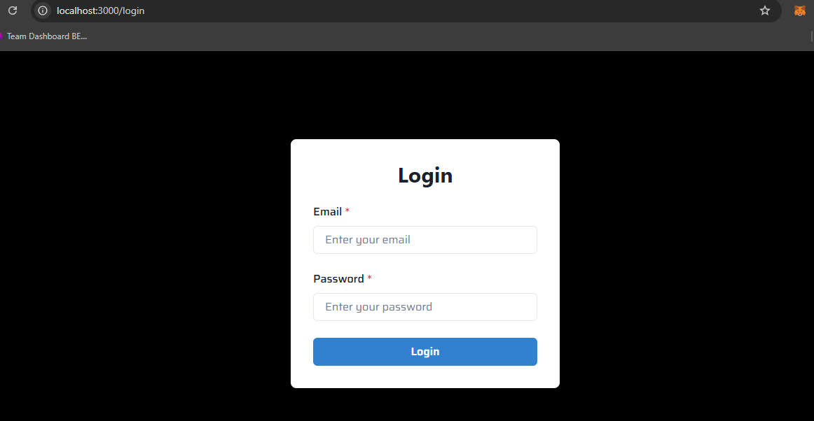
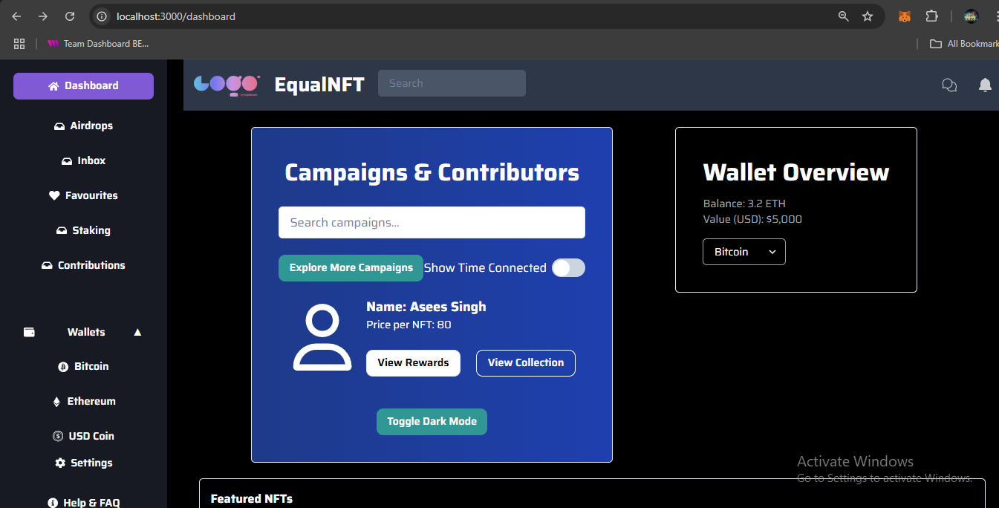
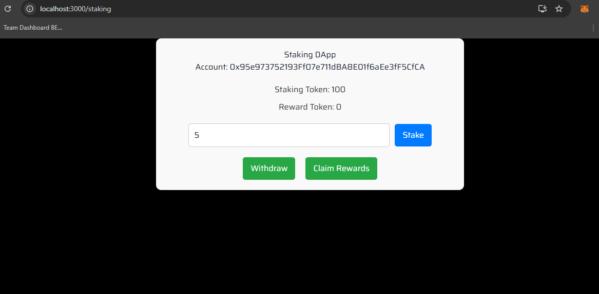
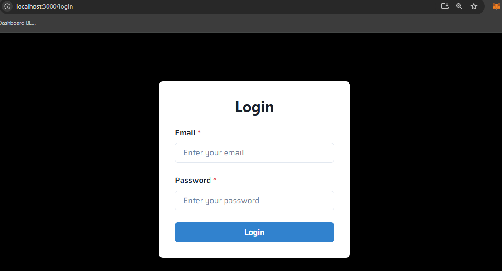
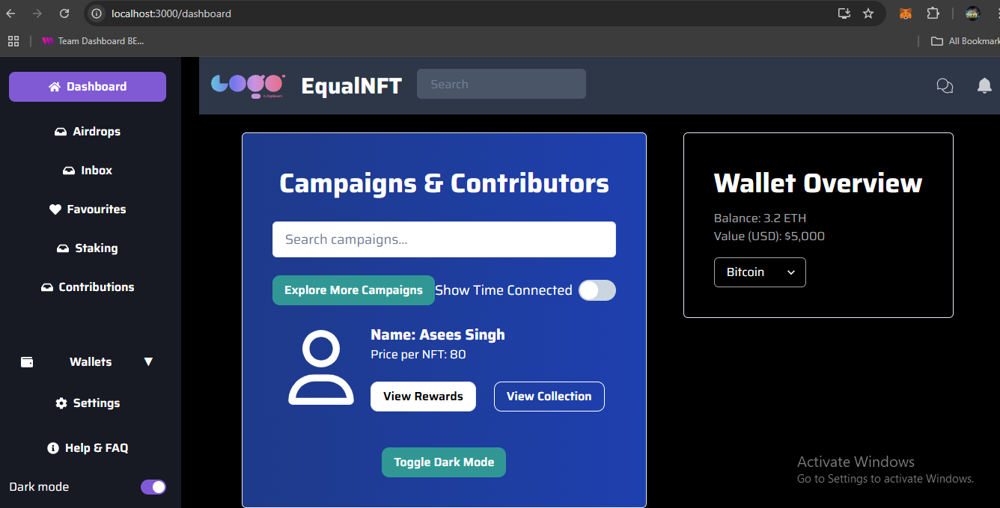
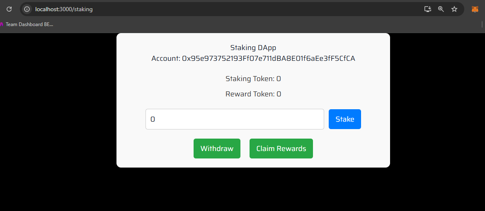
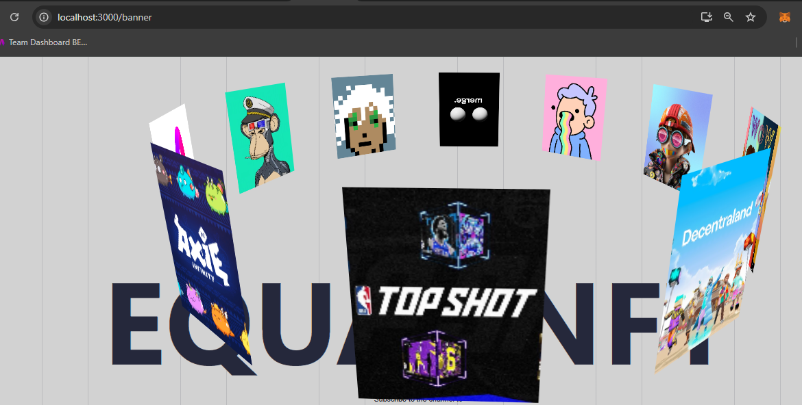

Project Title: Staking DApp
Description
This is a decentralized application (DApp) that allows users to stake tokens on the Ethereum blockchain. Users can stake their tokens, withdraw them, and claim rewards. This project utilizes Web3.js to connect to the blockchain, MetaMask for wallet integration, and React for the frontend. Our user-centric platform offers a dashboard similar to Notion to enhance productivity and manage all campaigns, providing an experience comparable to Galxe compass.

Deployed Smart Contract
Staking Contract Address: 0x10Ee17f36eDD22b7b731dcE7950a41b410947f03
Reward Token Contract Address: 0x13E374e17d1F12bA81cB30D50c89018835c16D7E
Blockchain Used: Ethereum
Screenshots
Login 

Main Interface-Dashboard

Staking Tokens

Team Information
Team Name: Equalify
Team Members:
Team Lead   - Guraasees Singh Taneja - Role: Smart Contract & Full-stack Developer
Team Member - Chanmeet Kaur          - Role: Front-end Developer 
Team Member - Mandeep Singh          - Role: Full-stack Developer

Hackathon Information
Hackathon Name: Hack7 X Gtbit
Hackathon Website: https://tezos.com/ 
At DevPost : https://hack7days-ti-x-gtbit-2.devpost.com/ 

Here's a README.md template you can use for your project submission. Make sure to replace the placeholders with the actual details specific to your project.

Project Title: Staking DApp
Description
This is a decentralized application (DApp) that allows users to stake tokens on the Ethereum blockchain. Users can stake their tokens, withdraw them, and claim rewards. This project utilizes Web3.js to connect to the blockchain, MetaMask for wallet integration, and React for the frontend.

Deployed Smart Contract
Staking Contract Address: 0x10Ee17f36eDD22b7b731dcE7950a41b410947f03
Reward Token Contract Address: 0x13E374e17d1F12bA81cB30D50c89018835c16D7E
Blockchain Used: Ethereum

Login 

Main Interface
DashBoard

Projects and Tasks within each Project

Staking Tokens

Demo Video
Here is a short video demonstration of the DApp in action. The video showcases the functionality of staking tokens, withdrawing tokens, and claiming rewards. Demo Video

Note: Upload the video in the video folder and link it here, or use an external link if it's hosted elsewhere.

Team Information
Team Name: [Your Team Name]
Team Members:
[Member 1 Name] - Role: [e.g., Smart Contract Developer]
[Member 2 Name] - Role: [e.g., Frontend Developer]
[Member 3 Name] - Role: [e.g., UI/UX Designer]
Hackathon Information
Hackathon Name: Hack7 X Gtbit
Hackathon Website: https://tezos.com/ 
At DevPost : https://hack7days-ti-x-gtbit-2.devpost.com/ 

How to Run the Project Locally
Clone the repository:

git clone <https://github.com/GuraaseesSingh/EqualNFT>
cd StakingDApp
Install Dependencies:

npm install
Start the Development Server:

npm start
Connect MetaMask: Make sure to have MetaMask installed and connected to the Ethereum network. You should also have some test Ether in your account.