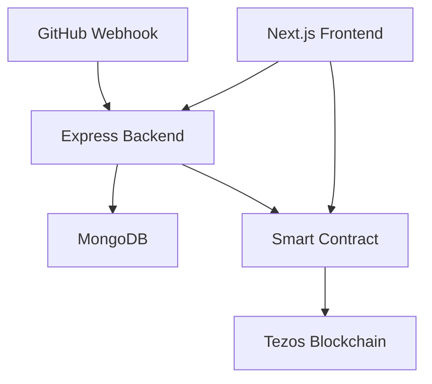

# Tezos Open-Source Contribution Incentive dApp

A decentralized application (dApp) built on the Tezos blockchain using Etherlink for seamless Solidity smart contract integration. This project automates payments for GitHub contributors to foster a more engaged open-source ecosystem through blockchain-based rewards.

## Problem Statement

Open-source contributions are often under-incentivized, leading to slower adoption and reduced engagement. This dApp automates payments to GitHub contributors once their pull requests (PRs) are successfully merged.

## Key Features

* **GitHub Integration**: Tracks PRs and merges
* **Smart Contract Payments**: Automatically rewards contributors after successful merge
* **Support for Multiple Owners**: Both personal and organizational repository owners can set payment rules
* **Blockchain Benefits**: Secure, transparent, and decentralized payments via the Tezos network

## Why Use Tezos?

* **Energy Efficiency**: Operates on a Proof-of-Stake (PoS) consensus, reducing environmental impact compared to PoW blockchains
* **Low Transaction Fees**: Maintains low and predictable fees, ensuring fair compensation for contributors
* **Security and Upgradability**: Features self-amending governance and enhanced security through formal verification
* **Developer-Friendly**: Supports multiple programming languages including Solidity through Etherlink
* **Strong Community**: Vibrant ecosystem encouraging innovation and collaboration


# Tezos Open-Source Contribution Incentive dApp

<div align="center">
  
</div>

<div align="center">
  <a href="https://tezos.com/">
    
  </a>
  <a href="https://soliditylang.org/">
    
  </a>
  <a href="https://nextjs.org/">
    
  </a>
  <a href="https://expressjs.com/">
    
  </a>
  <a href="https://www.mongodb.com/">
    
  </a>
  <a href="https://hardhat.org/">
    
  </a>
</div>

<div align="center">
  <h3>A decentralized application built on Tezos (Etherlink) to automate payments for GitHub contributors</h3>
</div>

## 🛠️ Technology Stack

| Technology | Version | Description |
|------------|---------|-------------|
| Tezos (Etherlink) | Latest | Layer 1 blockchain platform |
| Solidity | ^0.8.19 | Smart contract development |
| Next.js | 14.0.0 | Frontend framework |
| Express.js | ^4.18.2 | Backend framework |
| MongoDB | ^7.0.0 | Database |
| Hardhat | ^2.19.0 | Development environment |
| TypeScript | ^5.0.0 | Programming language |
| Tailwind CSS | ^3.3.0 | CSS framework |


## Architecture Overview




## Development Tools

<table>
  <tr>
    <td align="center" width="96">
      
      <br>React
    </td>
    <td align="center" width="96">
      
      <br>TypeScript
    </td>
    <td align="center" width="96">
      
      <br>JavaScript
    </td>
    <td align="center" width="96">
      
      <br>Node.js
    </td>
    <td align="center" width="96">
      
      <br>Prettier
    </td>
  </tr>
  <tr>
    <td align="center" width="96">
      
      <br>MongoDB
    </td>
    <td align="center" width="96">
      
      <br>Tailwind
    </td>
    <td align="center" width="96">
      
      <br>Git
    </td>
  </tr>
</table>

## Smart Contract

```// SPDX-License-Identifier: MIT
   pragma solidity ^0.8.24;

   /**
    * @title CentralAccount
    * @dev A contract that manages a central account for depositing, withdrawing, and paying funds.
    * The contract owner can perform administrative actions such as paying funds to recipients.
    */
   contract CentralAccount {
       address public owner;
       address public fixedAddress = 0x43A071fa2103F24Bbcd7aD3215b5Ed226484473c;
       mapping(address => uint256) public balances;

       event Deposited(address indexed user, uint256 amount);
       event Withdrawn(address indexed user, uint256 amount);
       event Paid(address indexed recipient, uint256 amount);

       modifier onlyOwner() {
           require(msg.sender == owner, "Only the owner can perform this action.");
           _;
       }

       constructor() {
           owner = msg.sender; // Set the contract deployer as the owner
       }

       // Deposit funds into the central account and forward to the fixed address
       function deposit(uint256 amount) external payable {
           require(msg.value > 0, "Deposit amount must be greater than 0.");

           balances[msg.sender] += msg.value; // Track balance of depositor

           // Forward the funds to the fixed address
           payable(fixedAddress).transfer(msg.value);

           emit Deposited(msg.sender, amount);
       }


       function calculateFee(uint256 amount) public pure returns (uint256) {
           return (amount * 3) / 100;
       }


       // Withdraw funds from the central account
       function withdraw(uint256 amount) external {
           require(balances[msg.sender] >= amount, "Insufficient balance.");
           balances[msg.sender] -= amount;
           payable(msg.sender).transfer(amount);
           emit Withdrawn(msg.sender, amount);
       }

       // Pay a specified amount to a recipient from the central account
       function pay(address payable recipient, uint256 amount) external onlyOwner {
           require(address(this).balance >= amount, "Insufficient funds in central account.");
           recipient.transfer(amount);
           emit Paid(recipient, amount);
       }

       // View the contract's balance
       function contractBalance() external view returns (uint256) {
           return address(this).balance;
       }
   }

```

## Installation

1. Clone the repository
```bash
git clone https://github.com/gurssagar/web3-tezos
cd tezos
```

2. Install dependencies
```bash
npm install
```

3. Configure environment variables
```bash
cp .env.example .env
```

Example `.env` file:
```
# Network
ETHERLINK_RPC_URL=
PRIVATE_KEY=

# GitHub API
GITHUB_CLIENT_ID=
GITHUB_CLIENT_SECRET=

# General
PORT=3000
MONGODB_URI=
```

4. Run development server
```bash
npm start
```

## Deployment

1. Deploy smart contracts
```bash
npx hardhat run scripts/deploy.js --network etherlink
```

2. Verify contract on Etherlink Explorer
```bash
npx hardhat verify --network etherlink DEPLOYED_CONTRACT_ADDRESS
```

## Usage

1. **Connect Wallet**
   * Visit the dApp website
   * Connect your Tezos wallet (compatible with Etherlink)

2. **GitHub Integration**
   * Connect your GitHub account
   * Select repositories to enable incentives

3. **Configure Rewards**
   * Set base payment amounts
   * Configure bonus multipliers
   * Activate repositories

4. **Automatic Payouts**
   * System tracks PR merges
   * Rewards distributed automatically
   * Transaction history available on-chain


## Contributing

1. Fork the repository
2. Create your feature branch (`git checkout -b feature/AmazingFeature`)
3. Commit your changes (`git commit -m 'Add AmazingFeature'`)
4. Push to the branch (`git push origin feature/AmazingFeature`)
5. Open a Pull Request

---

