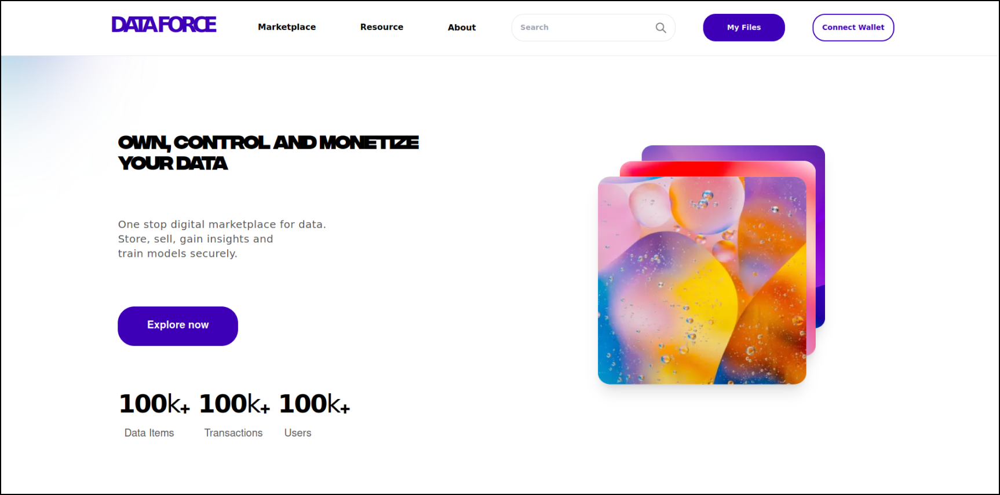
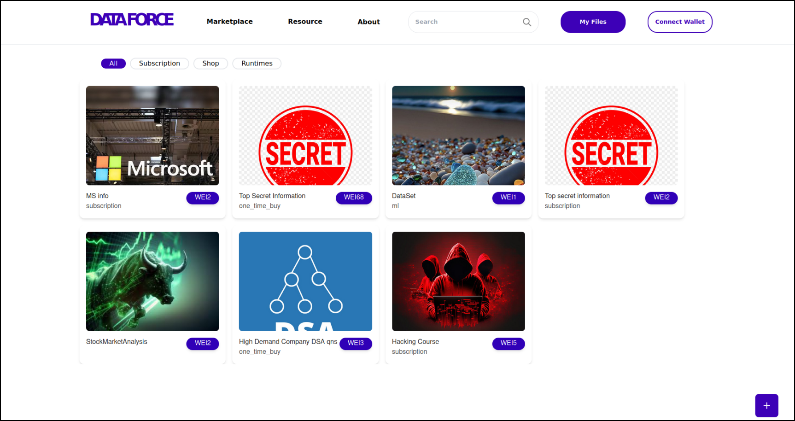
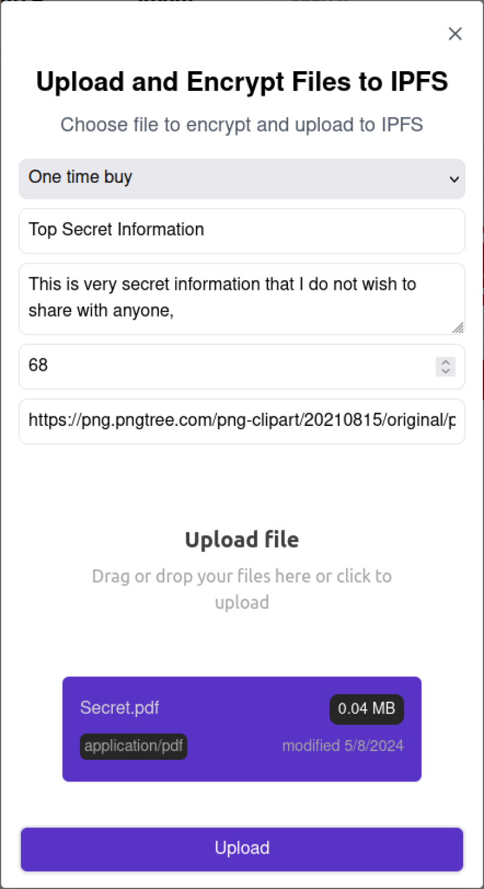

## Data Force is live at [link](https://sudoforce-tezos.vercel.app)

## About Data Force
    Data Force is a decentralized data marketplace application, running on a EVM blockchain network. This application provides users with a means to store data truly private, with no central access given to anyone, even the application owners. Users can also choose to monetize their data, by selling it for a fixed price, or a subscription model for growing data. It can also be used as a secure private cloud. Made a secure server which takes in a ML models and trains it with decentralized data from IPFS without revealing the actual dataset content and returns a trained model with its analysis.

### Deployed Contract Address - 0xfeEeFF8300C5928282ea9627625AbE619Bf13aC
 \- running on Etherlink Blockchain.

### Features implemented
✔️ File encryption, and upload to IPFS

✔️ Secure transmission of private keys across network

✔️ Uploading unique image ID with decrypt key to the smart contract

✔️ Managing access to different files among various users

✔️ Ability to sell and purchase files 

✔️ Deployed the Solidity Contract on Etherlink and Sepholia


## Requirements:
* Node JS
* Metamask wallet
* Flask to run ML service

## Getting Started with Frontend

```bash
npm install
npm run dev
```

Open [http://localhost:3000](http://localhost:3000) with your browser to see the results.

To interact with the blockchain network, users are expected to have a Sepholia account with test credits.  

### The Flask service for ML model can be found in the 'Model' folder

## Screenshots




## To know more about DATAFORCE,
Presentation and Demo: [Link](https://drive.google.com/drive/u/0/folders/1JAkCXe1lDt1r1a7zJxtui2V7LwCzyRWM)


## More about us:

### Team Name 
- **Sudo Force**  
  - **Akshay A**
  - **Akshay V**
  - **Akhshay mahesh A N**  
  - **Vishrudh Raj R S**  
  - **Dhasarathan A**

### Hackathon Participated in:   

- **Transfinitte** ([link](https://transfinitte.com/)) <br/>
  Hosted by: The Technical Council, National Institute of Technology, Tiruchirapalli. 
