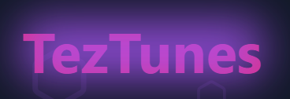
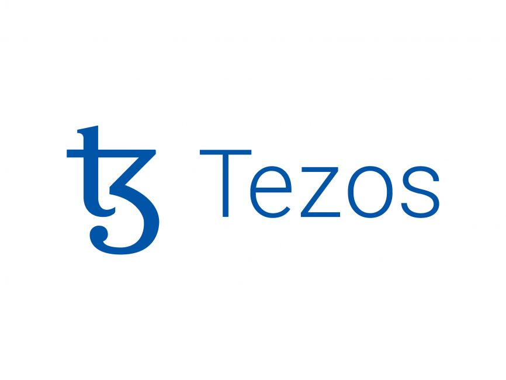
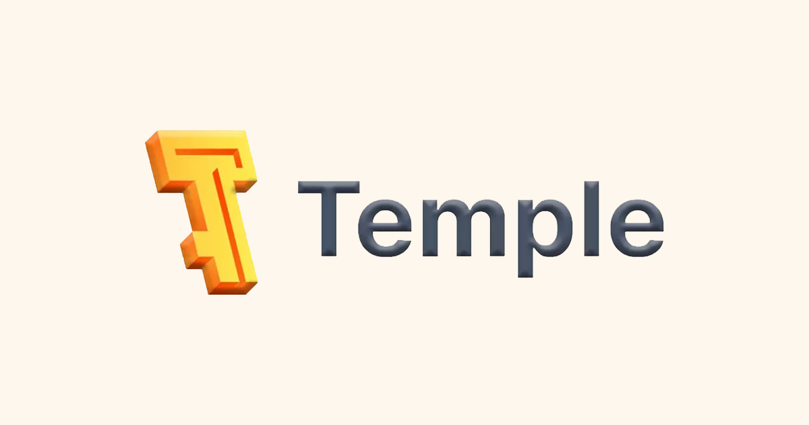
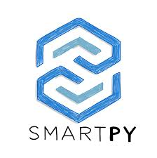
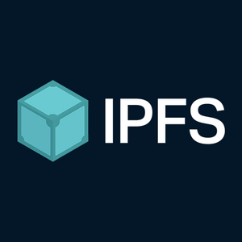

# TezTunes

  

<h3 align="center">A Decentralized Blockchain Marketplace for Artists</h3>

## 🎵 Project Overview

TezTunes is a revolutionary decentralized blockchain marketplace that provides transparent, secure, and automated earning distribution to artists. Leveraging the power of Tezos blockchain technology, we aim to transform the music industry by ensuring fair compensation and protecting artists' intellectual property.

## 🛠️ Technology Stack

### Blockchain Technologies
| Technology | Purpose |
|:---:|:---|
|  | Blockchain Platform |
|  | Wallet Integration |
|  | Smart Contract Development |

### Frontend Technologies
| Technology | Purpose |
|:---:|:---|
|  | User Interface Development |

### Decentralized Storage
| Technology | Purpose |
|:---:|:---|
|  | Decentralized File Storage |

## 🚀 Key Features

- **Transparent Royalty Distribution**
  - Automated smart contract-based earnings
  - Real-time royalty tracking
  - Immutable transaction records

- **Secure Artist Verification**
  - Blockchain-backed artist profiles
  - Intellectual property protection
  - Tamper-proof content ownership

- **Decentralized Marketplace**
  - Direct artist-to-listener platform
  - Reduced intermediary costs
  - Fair compensation model

## 📹 Demo Video

[![TezTunes Project Demo]
<video src="./demo/tez-tunes-demo.mp4" alt="demo" controls/>

## DEPLOYED SMARTPY CONTRACT ADDRESS

KT19TyAUmi9KaNgYmdTejEAm9HJCGT3pELV8 - TEZOS BLOCKCHAIN USED

## 👥 Team CTRL + ALT + ELITE

| | Name | Role & Expertise |
|:---:|:---|:---|
|  | Krishna Tiwari | Team Leader |
| | Ashwani Kumar Jha | Team Member |
|  | Priyanshu Singh | Team Member |
|  | Sutanu Kumar | Team Member |

## 🏆 Hackathon Achievement

**Second Prize Winner** at HACKWITHMAIT5.0

---

Empowering Artists Through Blockchain Technology

